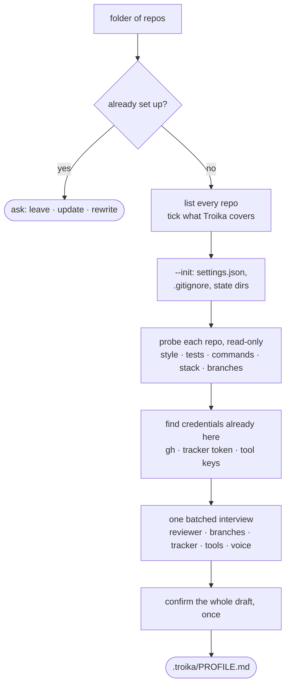
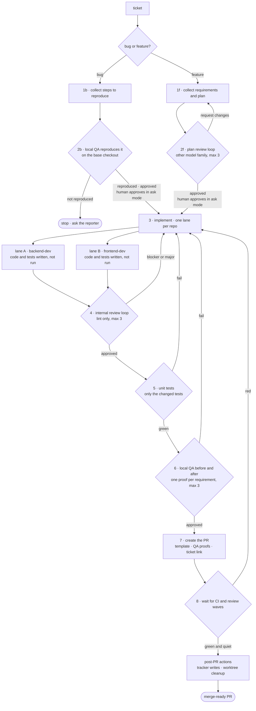
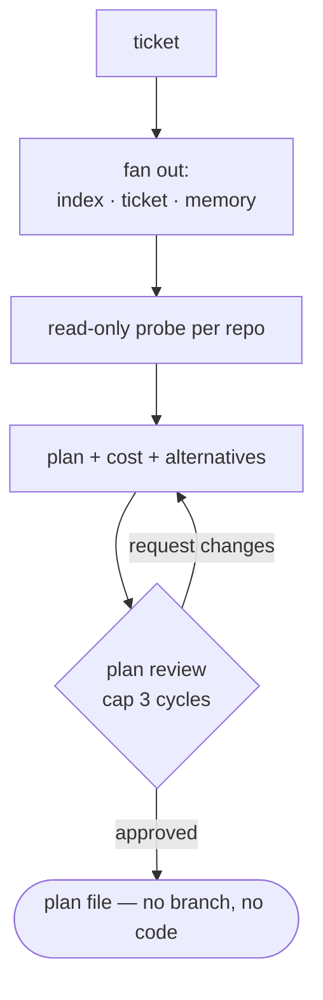
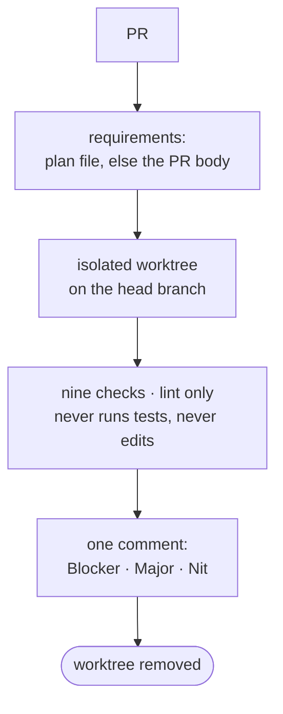
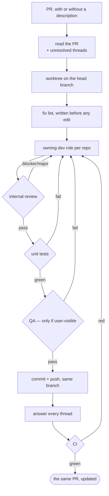
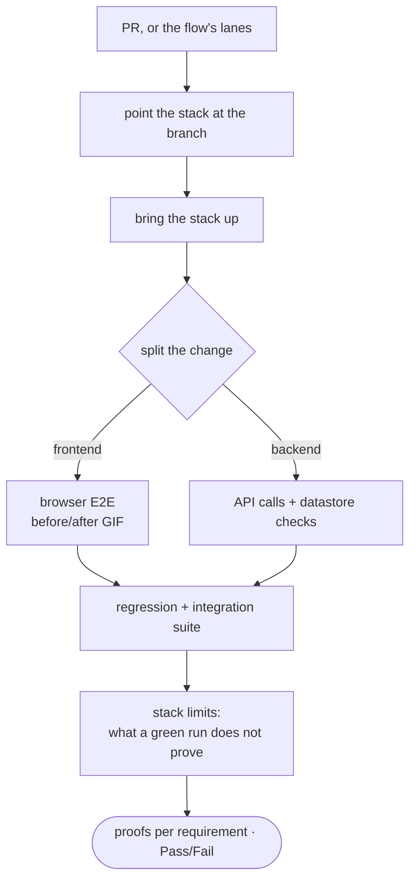
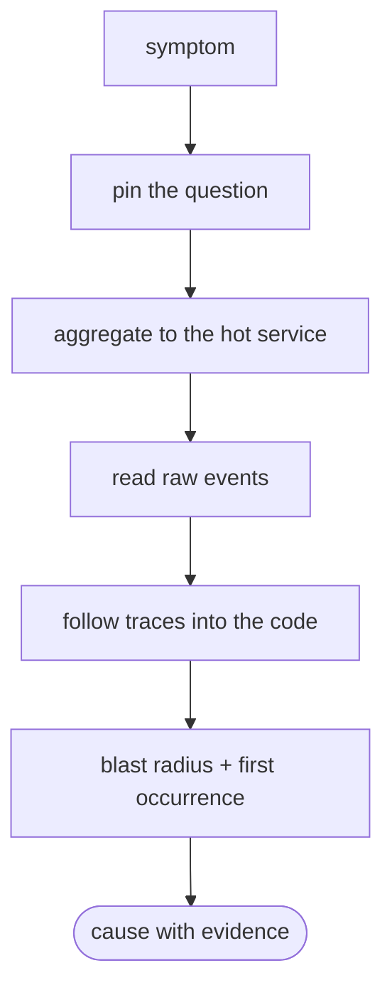
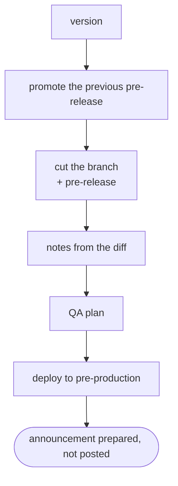
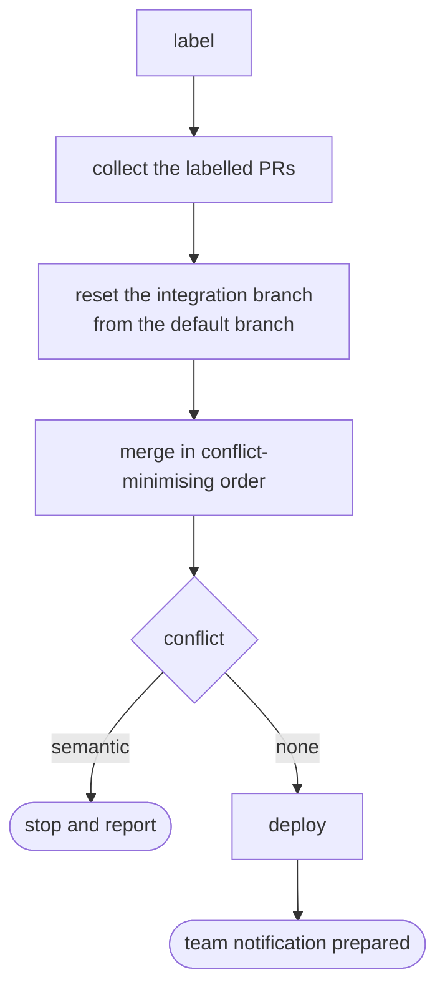

# Troika


<sub>Nikolai Sverchkov (1817–1898), _A Troika Ride Through The Snow_. Public domain, via
[Wikimedia Commons](https://commons.wikimedia.org/wiki/File:Nikolai_Sverchkov_-_A_Troika_Ride_Through_The_Snow.jpg).</sub>

**Troika turns a tracker ticket into a reviewed, QA-verified pull request.** An AI
coding-agent pipeline for full-stack developers — plan, implement, review, test, verify,
ship — with a gate at every step. Install it as a plugin for
[Claude Code](https://claude.com/claude-code),
[Codex](https://developers.openai.com/codex/cli/) or [Cursor](https://cursor.com), or run it
from plain markdown in any agent.

[](https://github.com/vsdudakov/troika/actions/workflows/check.yml)
[](LICENSE.md)
[](#install)
[](#install)
[](#install)
[](https://github.com/sponsors/vsdudakov)

📖 **Documentation: [vsdudakov.github.io/troika](https://vsdudakov.github.io/troika/)**

Troika is an **agentic development pipeline**: eight specialised roles — architect,
backend and frontend developers, reviewer, tester, QA, releaser, commenter — that take a
ticket from your tracker and hand back a pull request with proofs attached. It automates the
whole loop a full-stack developer runs by hand: requirements and planning, parallel
implementation in git worktrees, **automated code review**, unit tests, **QA verification on
your real local stack**, the release PR, and the CI and review-bot watch after it. Release
cuts, **release notes** and demo builds are in the box too.

It is not a framework and not a runtime: it is **plain markdown** — roles, procedures and
templates — that any coding agent loads by path, wired into slash commands for the three
hosts that ship a plugin system.

One command runs the whole pipeline:

```
/tr:dev SCRUM-123
```

Behind it: the architect plans, a **different model family** reviews the plan and loops it
back, dev roles implement in parallel worktrees, the reviewer runs nine checks on the diff,
the tester runs only the tests the change developed, QA verifies on your real local stack
with before/after proofs, and the releaser opens the PR and watches CI. Each role runs in its
own context and hands off through files — never shared memory — so nothing downstream
inherits an earlier role's assumptions.

**Nothing in this repository names your organisation.** No repo, command, branch, tracker,
URL, or person. Every such fact comes from one directory in your workspace — `.troika/`,
written by `/tr:setup` — holding the profile and the paths. Run setup in another folder of
repos and the same pipeline runs there unchanged.

---

## Highlights

- 🚦 **Gates, not vibes.** Every step is a gate: a plan is not approved until a reviewer on a
  different model family approves it, a diff is not pushed until nine checks pass, a PR is
  not done until CI is green and the review bots are quiet.
- 🧑‍🤝‍🧑 **Eight roles, eight contexts.** architect · backend-dev · frontend-dev · reviewer ·
  tester · qa · releaser · commenter — each with its own scope, model, effort, and hard
  refusals. Dev roles write tests but never run them; the reviewer never runs anything.
- 🔌 **One tree, three hosts.** The same skills are `/tr:*` commands in Claude Code and
  Cursor, and model-invoked skills in Codex. Or skip the plugin and point any agent at the
  files by path.
- 🏢 **Organisation-neutral by construction.** Org facts live in your `.troika/PROFILE.md` and
  are cited **by anchor**; a procedure that hardcodes one is a bug, and CI fails it.
- 🧭 **Setup reads before it asks.** `/tr:setup` investigates your repos — manifests, CI,
  linters, remotes — drafts every profile section it can prove, and only then asks about the
  handful no file records.
- 📂 **Per-workspace paths.** `.troika/settings.json` says where plans, worktrees and memory
  live — one per folder-of-repos, so a single installed plugin serves every client and org you
  work in.
- 🧪 **It is tested on itself.** A structural gate checks every link, anchor, and file shape;
  a behavioural gate plants twenty-one known defects in a toy repo and asserts the role that
  claims to catch each one does.

## Install

**Claude Code**

```bash
claude plugin marketplace add vsdudakov/troika
claude plugin install tr@troika          # add --scope project to pin it to one workspace
```

**Codex**

```bash
codex plugin marketplace add vsdudakov/troika
codex plugin add tr@troika
```

**Cursor**

```bash
cursor-agent plugin marketplace add https://github.com/vsdudakov/troika
```

Restart the host, then set up the folder that holds your repos — once per workspace:

```
/tr:setup
```

## Set up a workspace

A _workspace_ is the folder holding your repos, and `/tr:setup` is what makes it one. It
reads your repos, drafts the profile from what they prove, asks about what they cannot, and
writes:

```
<workspace>/
├── .troika/
│   ├── settings.json   where this workspace keeps its files — committed
│   ├── PROFILE.md      the project profile: what your codebase is — committed
│   ├── .gitignore      keeps the three below out of your history
│   ├── scratchpad/     plans, reviews, work logs, QA proofs
│   ├── worktrees/      one checkout per branch
│   └── memory/         dated observations about this workspace
├── backend/            your repos, each an independent clone
└── frontend/
```



Most of the profile is already in your repos — manifests, `Makefile`s, CI workflows, linter
configs, git remotes, PR templates — so setup drafts the stack, the verification commands, the
test framework, the base branch, the deploy triggers and the release scheme, and shows them for
confirmation. It asks you only about what no file records: the tracker and **which writes a
role may make**, ownership, voice, gotchas, what a green local run does not prove, and which
models and efforts the roles run on — including the second tool that reviews independently.

Run it again and it changes nothing without asking — leave it as it is, update it against what
the repos now say, or rewrite the profile from the template.

The profile's **anchors are a contract**. Roles cite them by id — `` `#commands` ``,
`` `#branches` ``, `` `#tracker` `` — and a missing one is a role reading a reference that
answers nothing. `python3 tests/check.py` verifies every anchor the tree cites exists in
[`PROFILE.template.md`](PROFILE.template.md). Where the profile declares a _limit_ — no ticket
transitions, one repo and one PR, no build step, a base branch that is not `origin/main` — the
roles follow the profile, not the generic wording.

Paths come from `.troika/settings.json`. Every key is optional, relative values resolve against
the workspace, and absolute ones are taken as-is — so worktrees can live on a faster disk:

```json
{
  "profile": ".troika/PROFILE.md",
  "scratchpad": ".troika/scratchpad",
  "worktrees": "/Volumes/fast/acme/worktrees",
  "memory": ".troika/memory"
}
```

Roles run with their cwd deep inside a worktree, so they never guess a path — they resolve one:

```bash
eval "$(python3 "${CLAUDE_PLUGIN_ROOT}/plugin/resolve.py")"
# exports TROIKA_WORKSPACE, TROIKA_PROFILE, TROIKA_WORKTREES, TROIKA_SCRATCHPAD, TROIKA_MEMORY
```

The resolver walks up from wherever the role is standing to the workspace that owns it, so one
installed plugin serves every workspace on the machine. `.troika/settings.json` is the only
marker and nothing falls back: no workspace above you is a stop, not a default. See
[plugin/README.md](plugin/README.md#configuring-a-workspace).

## The pipeline

[`develop-flow`](skills/develop-flow/SKILL.md) is the whole thing: nine steps, each one a gate.

**How a ticket opens depends on what it is**; from step 3 the two paths are one flow:

- **bug** — collect the steps to reproduce → **local QA reproduces it on the base checkout** → *(reporter review, under `--ask`)* → fix in parallel lanes → internal review loop (max 3) → unit tests → **local QA before/after** → PR with the proofs → CI + post-PR actions
- **feature** — collect requirements → plan → **plan review loop** (a different model family, max 3) → *(reporter review, under `--ask`)* → implement in parallel lanes → internal review loop (max 3) → unit tests → **local QA before/after** → PR with the proofs → CI + post-PR actions

The reporter review is the only step that waits for a person, and a plain run does not run it —
`/tr:dev SCRUM-123` goes from ticket to PR unattended. `--ask` puts the gate in.



`2r` is the only step that waits for a person: a plain run passes straight through it, and
`--ask` is what makes it stop for the reporter's answer ([Run it unattended](#run-it-unattended)).

| Step | What happens                                                                                                                                                                                                                             | Who                                                                           |
| ---- | ---------------------------------------------------------------------------------------------------------------------------------------------------------------------------------------------------------------------------------------- | ----------------------------------------------------------------------------- |
| 0    | Fan out — refresh the code index, read the ticket, read memory, **classify it bug or feature**                                                                                                                                           | orchestrator                                                                  |
| 1b   | _Bug_ — collect the reporter's steps to reproduce, probe for the cause, pre-warm the stack                                                                                                                                               | [architect](agents/architect.md)                                              |
| 2b   | _Bug_ — **reproduce it on the base checkout**, before any fix. Not reproduced → stop and ask                                                                                                                                             | [qa](agents/qa.md)                                                            |
| 1f   | _Feature_ — collect requirements, write the plan                                                                                                                                                                                         | [architect](agents/architect.md)                                              |
| 2f   | _Feature_ — **plan review loop**, a different model family approves or sends it back (cap 3 rounds)                                                                                                                                      | [reviewer](agents/reviewer.md)                                                |
| 2r   | **Reporter review** — the person who filed it reads what will be built, or what was reproduced, and answers _go ahead_ / _change this_ / _not this at all_. The only gate that waits for a person, and it runs **only** on a `--ask` run | [commenter](agents/commenter.md) asks, the reporter answers                   |
| 3    | Development — one lane per repo, own worktree, tests written but not run                                                                                                                                                                 | [backend-dev](agents/backend-dev.md) · [frontend-dev](agents/frontend-dev.md) |
| 4    | **Internal review loop** — nine checks on the local diff, lint only, nothing posted                                                                                                                                                      | [reviewer](agents/reviewer.md)                                                |
| 5    | Unit tests — the change's own tests only, parallel lanes, failures routed back                                                                                                                                                           | [tester](agents/tester.md)                                                    |
| 6    | **QA on the real local stack** — before/after per requirement: GIFs for UI, API + datastore for backend                                                                                                                                  | [qa](agents/qa.md)                                                            |
| 7    | Release — commit, push, PR from your template with proofs, ticket updated                                                                                                                                                                | [releaser](agents/releaser.md)                                                |
| 8    | CI watch, review-bot waves, then the post-PR actions — tracker writes, worktree cleanup                                                                                                                                                  | [releaser](agents/releaser.md)                                                |

A bug fix carries the regression test that encodes the reproduction — internal review reads
the test against `-repro-1.md`, and one that would pass on the base ref is a Blocker. The
failing capture from step 2b is reused as the `before` proof at step 6, so the pair the PR
carries costs one stack boot, not two.

### Run it unattended

**Exactly one gate waits for a person** — 2r — and a plain run does not run it. There is one
flag, and it adds the gate rather than removing it:

```
/tr:dev SCRUM-123            # unattended, ticket to PR
/tr:dev SCRUM-123 --ask      # stop once, at 2r, for the reporter's answer
```

Your profile's `#autonomy` anchor says who that reporter is, where `--ask` reaches them, how
long it waits, and what happens when the wait runs out. Every run states which way it ran.

Running unattended removes an **approval**, not a **judgment**. It never silences a stop
condition — a hit cap, an unowned repo, a bug that will not reproduce — and never overrides what
your profile marks never-automatic: scope changes, irreversible migrations, public contract
changes, production deploys. An open question with no safe assumption stops the run instead of
guessing. Everything it did assume is written into the plan and repeated in the PR body.

Every outward-facing sentence on the way — PR body, ticket comment, review reply — is written
by the [commenter](agents/commenter.md) in your workspace's voice.

## Using it on a real team

Who types what, in the order a week actually happens.

**A developer with an assigned ticket** — one command, whole pipeline. `/tr:dev` classifies the
ticket itself: a bug gets reproduced before it is fixed, a feature gets planned and reviewed.

```
/tr:dev SCRUM-123                # ticket to merge-ready PR
/tr:spike SCRUM-123              # or plan it first and build nothing — sizing, shaping, a design call
```

**After the PR is open** — fix it in place, on the same branch. Nothing here opens a second PR.

```
/tr:fix https://github.com/<org>/<repo>/pull/41
/tr:fix https://github.com/<org>/<repo>/pull/41 stream the export instead of buffering it
```

With no words after the URL it works through every unresolved review comment; with words, it
does what you said and re-runs the same gates either way.

**Developers reviewing each other's PRs** — the review is read-only, the QA run is not a review.

```
/tr:review https://github.com/<org>/<repo>/pull/41    # nine checks, one posted comment
/tr:qa     https://github.com/<org>/<repo>/pull/41    # boot the stack, before/after proofs, Pass or Fail
```

**A production incident, or just a stack trace someone pasted** — read-only, changes nothing.

```
/tr:triage <stack trace>
```

**The release manager** — the two scheduled jobs, both stopping before anything a human owns.

```
/tr:demo    release/X.Y.Z        # build the demo integration branch, deploy it, draft the notification
/tr:release release/X.Y.Z        # promote the previous cut, branch, notes, QA plan, pre-production deploy
```

`/tr:demo` takes the demo label your profile declares (`#demo`); `/tr:release` takes the
version or release branch in your own scheme (`#release`). Both stop at the announcement and
wait for a human to send it.

Everything above needs `/tr:setup` to have been run once in the folder that holds your repos.

<details open>
<summary><b>What each of the other commands does, drawn</b></summary>

**`/tr:spike`** — plan it, build nothing.



**`/tr:review`** — read-only PR review, one comment posted.



**`/tr:fix`** — fix an open PR in place; never a second PR.



**`/tr:qa`** — verify on the real local stack.



**`/tr:triage`** — production symptom to cause, changing nothing.



**`/tr:release`** — cut a periodic release.



**`/tr:demo`** — build the demo integration branch.



</details>

Nine commands, and every other procedure — plan-review, implement-change, internal-review,
run-unit-tests, release-pr, release-notes, ticket-intake — is still a skill all three hosts
discover, invocable by name when you want just that step. Each command's flow, drawn:
[Commands reference](https://vsdudakov.github.io/troika/reference/commands/).

## What is in the box

|                                              |                                                                                                                                             |
| -------------------------------------------- | ------------------------------------------------------------------------------------------------------------------------------------------- |
| [`agents/`](ROLES.md)                        | the eight roles — scope, inputs, rules, gates, output, and the model tier and effort each one needs (the ids themselves are your profile's) |
| [`skills/`](skills/README.md)                | 16 procedures, 5 references, 2 templates — one directory per skill, `SKILL.md` inside                                                       |
| [`plugin/`](plugin/README.md)                | the three host manifests, the generated commands, and [`resolve.py`](plugin/resolve.py)                                                     |
| [`tests/`](tests/README.md)                  | the two gates on this tree                                                                                                                  |
| [`PROFILE.template.md`](PROFILE.template.md) | the profile setup fills in, and the anchor contract                                                                                         |

Procedures: `develop-flow` · `spike` · `plan-review` · `implement-change` ·
`internal-review` · `run-unit-tests` · `qa-verify` · `release-pr` · `pr-review` · `fix-pr` ·
`ticket-intake` · `incident-triage` · `demo-prep` · `release-cut` · `release-notes` ·
`workspace-setup` — nine of them carry a `/` command, the rest are skills you name. References: `worktree` ·
`scratchpad` · `memory` · `cross-repo` · `tracker`. Templates: `plan-template` ·
`pr-template`.

Plans, proofs, worktrees and memory are **not in this repository at all** — they are
per-workspace, live under your `.troika/`, and are created wherever `settings.json` puts them.
Because they are _ignored_ rather than absent, `git clean -xfd` in a workspace deletes all
three, in-flight branches included. Clean with explicit paths or not at all.

## How it stays honest

You cannot unit-test a prompt. You _can_ test a gate — and both gates run on this repo in CI.

```bash
python3 tests/check.py          # structural: seconds, every commit
python3 tests/run.py --runs 5   # behavioural: real model runs, catch rate per case
```

[`check.py`](tests/check.py) asserts every link and anchor resolves, the profile anchors
exist in the template, the file shapes match what the READMEs declare, the reviewer's check
list matches its copies, the `/` commands are current, and that no file hardcodes a path the
workspace is allowed to move.

[`run.py`](tests/run.py) is the interesting one: `fixtures/repo` is a tiny layered app,
`cases/_base` implements its plan **correctly**, and each of twenty-one cases is that base
plus exactly one planted defect — a deferred import, a skipped layer, an N+1, a test that
asserts nothing, a secret, a work log that overstates its test count. The gate that claims to
catch each one has to catch it. Two of the twenty-one are controls: a clean diff must come
back approved, and a diff whose only problems are nits must not be blocked. A gate that flags
everything is worthless, and the controls are what prove it isn't.

Change a role file and measure what it cost you:

```bash
python3 tests/run.py --runs 5 > /tmp/before.txt   # on the old revision
python3 tests/run.py --runs 5 > /tmp/after.txt    # on the new one
diff /tmp/before.txt /tmp/after.txt
```

## Why Troika

Most agent setups are one long prompt and a lot of hope. Troika splits the work the way a
team does — someone plans, someone else reviews the plan, someone implements, someone else
reviews the diff, someone runs the stack — and makes each handoff a file with a fixed shape.
That buys three things a single context cannot: a reviewer that never saw the author's
reasoning, a QA pass that runs against your real stack instead of a summary of it, and a
failure that names the step it happened in.

It is deliberately **not** a framework. There is no runtime, no daemon, no vendor lock: it is
markdown your agent reads, so you can fork a role, delete a step, or run one procedure by
hand — and a Python script under 200 lines is the only executable in the critical path.

## Conventions

Roles run in separate contexts and hand off through files, never shared memory — the
[handoff contract](ROLES.md#handoff).

**Absolute paths.** Every role's cwd is inside a worktree, so `$TROIKA_SCRATCHPAD` is not
below it. Resolve the paths once per session ([Set up a workspace](#set-up-a-workspace)) and
use them verbatim; a relative path writes a file no later role finds.

<a id="shell-quoting"></a>
**Posting text through a shell.** Findings and PR bodies contain backticks, `$`, and quotes;
inside `"…"` the shell executes backticks as command substitutions and silently drops the
result. Always pass generated text through a quoted heredoc, never a double-quoted argument:

```bash
gh pr comment 42 --body "$(cat <<'EOF'
- **Major** `service/portfolio.py:88` — N+1 · use `select_related`
EOF
)"
```

The same applies to `gh pr create --body`, any tracker CLI's comment command, and
`git commit -m`.

**File shape.** Every role and skill opens with `name` and `description` frontmatter — the
one convention all three hosts read. Roles then carry a fixed header list and five sections
(`Scope` · `Inputs` · `Rules` · `Gates` · `Output`); skills carry a one-line header and
follow their kind's body shape. [`ROLES.md`](ROLES.md) and
[`skills/README.md`](skills/README.md) declare both, and `check.py` enforces them.

## Development

```bash
git clone https://github.com/vsdudakov/troika
cd troika
python3 tests/check.py              # structural gate — no model, no spend
python3 tests/run.py --check        # fixtures only — no model, no spend
python3 plugin/generate.py          # regenerate the / commands after editing a procedure
```

Editing a procedure? Its frontmatter drives the command that runs it, so regenerate and let
`check.py` confirm nothing drifted. Adding a role? It goes in `agents/` — and _only_ roles go
there, because hosts load every file in that directory as a subagent, which is why the roles
index lives at [`ROLES.md`](ROLES.md).

## Contributing

Issues and pull requests are welcome. Run `make check` and `make test-check` before opening
one; both must be green. If you change a role's rules or a procedure's gates, run the
behavioural suite with `make test RUNS=5` and put the catch rates in the PR — that is the only
evidence that matters here. See [CONTRIBUTING.md](CONTRIBUTING.md).

## Sponsor

Troika is MIT-licensed and developed in the open. If it saves your team time, please consider
[**sponsoring on GitHub**](https://github.com/sponsors/vsdudakov). Every bit helps and is
hugely appreciated. ❤️

## License

[MIT](LICENSE.md) © Troika contributors
