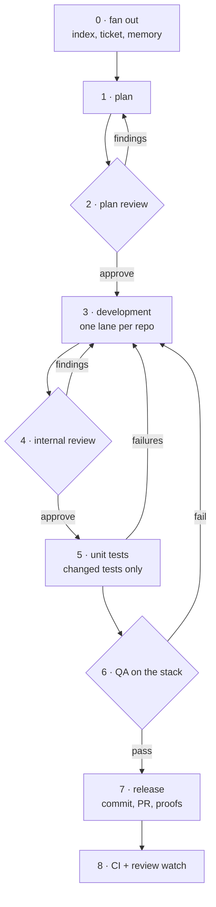

# The pipeline

[`develop-flow`](https://github.com/vsdudakov/troika/blob/main/skills/develop-flow/SKILL.md)
is the whole product. Nine steps, each one a gate: nothing advances past a step that failed.

## The steps

| # | Step | Gate |
| --- | --- | --- |
| 0 | **Fan out** — refresh the code index, read the ticket surfaces, list memory | a stale index is a wrong plan |
| 1 | **Plan** — requirements, repo order, pinned contracts, test plan, risks | the plan is the contract every lane codes against |
| 2 | **Plan review** — a reviewer on a *different model family* | replaces the human approval gate; cap 3 rounds, then a human decides |
| 3 | **Development** — one lane per repo, own worktree, tests written but **not run** | a lane touches only its own worktree |
| 4 | **Internal review** — [nine checks](../guides/review.md) on the local diff, lint only | nothing is pushed with a Blocker or Major open |
| 5 | **Unit tests** — only the tests the change developed, parallel lanes | a zero exit code is not a pass; collection counts are checked |
| 6 | **QA** — the real local stack, before/after GIFs for UI, API + datastore for backend | a requirement with no proof is "not verified", never "passed" |
| 7 | **Release** — commit, push, PR from your template, proofs, ticket | the only commits in the flow happen here |
| 8 | **CI + review watch** — until CI is green and the bots are quiet | a red check is routed back, never patched green |

## Why the plan is reviewed by a different model

The cheapest defect to fix is one that was never coded. Step 2 exists because a plan reviewed
by the same model that wrote it inherits the same blind spots — so the reviewer runs on
another family, reads the ticket surfaces itself, and checks the plan against the *ticket*
rather than against the plan's own summary of it. [Models and effort](models.md) covers the
assignment.

## What runs at the same time

Parallelism is declared, not improvised — the procedure lists what is safe and why.

Safe concurrently: index refresh per repo; read-only code probes; the two plan-review lenses;
dev roles in **different** repos (only with a pinned contract); the three review dimensions
over one diff; test lanes per area; QA's stack boot from the first dev lane's completion;
proof capture per requirement; CI watch per PR.

Must stay sequential: plan → any product code; dev roles sharing one repo's worktree; review
→ tests inside a lane; a fix → re-review → re-test; all lanes → QA; provider PR → consumer
PR; migration work inside one repo.

The rule underneath both lists: **concurrent work must write different files.** That is why
handoff files are numbered per cycle and why two roles never append to one.

## Loops and caps

Every backward arrow is bounded. Plan review caps at three rounds; internal review and QA
loop until clean but each cycle is a new numbered file, so an oscillation is visible rather
than silent. When a cap is hit, the flow stops and asks — it does not lower the bar.

## What the flow never does

- Never commits before step 7.
- Never runs a test in a dev role, or edits code in the reviewer or QA.
- Never greens a check by weakening it — no lowered coverage threshold, no `skip`/`xfail`, no
  disabled lint rule.
- Never fabricates a proof; unexercised requirements are reported as unverified.
