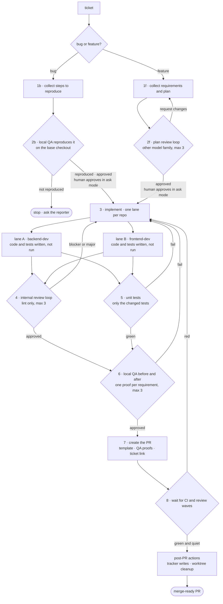

# The pipeline

[`develop-flow`](https://github.com/vsdudakov/troika/blob/main/skills/develop-flow/SKILL.md)
is the whole product. Nine steps, each one a gate: nothing advances past a step that failed.

**How a ticket opens depends on what it is**; from step 3 the two paths are one flow:

- **bug** — steps to reproduce → **local QA reproduces it on the base checkout** → *(reporter review, under `--ask`)* → fix → internal review ∥ unit tests → **local QA before/after** → PR with proofs → CI + post-PR actions
- **feature** — requirements → plan → **plan review loop** → *(reporter review, under `--ask`)* → implement → internal review ∥ unit tests → **local QA before/after** → PR with proofs → CI + post-PR actions

The reporter review is the only step that waits for a person, and a plain run does not run it:
`--ask` is what puts the gate in.



`2r` is the only step that waits for a person: a plain run passes straight through it, and
`--ask` is what makes it stop for the reporter's answer ([Running it without a human](#running-it-without-a-human)).

## The steps

| # | Step | Gate |
| --- | --- | --- |
| 0 | **Fan out** — refresh the code index, read the ticket surfaces, list memory, **classify the ticket** | a stale index is a wrong plan; the kind picks the next two steps |
| 1b | **Steps to reproduce** — the reporter's own steps, environment, observed versus expected, plus read-only cause probes | steps you improved are labelled as yours |
| 2b | **Reproduce** — QA runs those steps on the **base checkout**, before a fix exists | no reproduction, no fix: a fix for a bug nobody has seen fail is a guess |
| 1f | **Plan** — requirements, repo order, pinned contracts, test plan, risks | the plan is the contract every lane codes against |
| 2f | **Plan review** — a reviewer on a *different model family* | catches the plan that does not match the ticket; capped at the profile's loop cap (default 3) rounds, then a human decides |
| 2r | **Reporter review** — the person who filed it reads what will be built or what was reproduced, and answers *go ahead* / *change this* / *not this at all* | the only gate that waits for a person, and **it runs only on a `--ask` run** |
| 3 | **Development** — one lane per repo, own worktree, tests written but **not run** | a lane touches only its own worktree; a bug fix carries the regression test that encodes the reproduction |
| 4 | **Internal review** — [nine checks](../guides/review.md) on the local diff, lint only | nothing is pushed with a Blocker or Major open |
| 5 | **Unit tests** — only the tests the change developed, parallel lanes, started **with** step 4 rather than after it | a zero exit code is not a pass; collection counts are checked |
| 6 | **QA** — the real local stack, before/after per requirement | a requirement with no proof is "not verified", never "passed" |
| 7 | **Release** — commit, push, PR from your template, proofs, ticket | the only commits in the flow happen here |
| 8 | **CI watch + post-PR actions** — until CI is green and the bots are quiet, then the tracker writes and worktree cleanup | a red check is routed back, never patched green |

## Why a bug is reproduced instead of planned

A plan review asks whether a proposed change is sound. For a bug that is the wrong question
one step too early: the expensive mistake is fixing something that was never broken the way
the ticket says. So the bug path spends its gate on evidence instead — QA runs the reporter's
steps on the base checkout and captures the failure.

Two things fall out of that, both free:

- **The failing capture is the `before` proof.** Step 6 records only the `after` side, so the
  before/after pair the PR carries costs one stack boot rather than two.
- **The regression test has something to encode.** Internal review reads the new test against
  the reproduction, and a test that would pass on the base ref is a Blocker.

`Not reproduced` stops the flow and asks the reporter — an environment, a data shape, a user
role. A bug ticket that needs a design decision, or spans repos with a contract between them,
escalates to the feature path once and is planned properly.

## Running it without a human

Exactly one gate in the flow waits for a person: **2r**. Everything else is a machine gate that
either passes or routes work back — so unattended is not a mode to switch on, it is what the
pipeline already is:

```
/tr:dev SCRUM-123            # unattended, ticket to PR
/tr:dev SCRUM-123 --ask      # stop once, at 2r, for the reporter's answer
```

There is one flag and it *adds* the gate; there is no flag to remove it, because a plain run has
nothing to remove. Your profile's `#autonomy` anchor says who the reporter is, where `--ask`
reaches them, how long it waits, and what happens when that wait runs out. Every run states
which way it ran.

**Running unattended removes an approval, not a judgment.** It never silences a stop condition — a hit cap,
an unowned repo, a bug that will not reproduce, a stack that will not boot — and never overrides
the decisions your profile marks as never-automatic: scope changes, irreversible migrations,
public contract changes, production deploys. An open question with no safe assumption stops an
unattended run; under `--ask` it goes to the reporter. Everything the run assumed is written
into the plan and repeated in the PR body, so the human reading the PR sees what was decided for
them.

## Why the plan is reviewed by a different model

The cheapest defect to fix is one that was never coded. Step 2 exists because a plan reviewed
by the same model that wrote it inherits the same blind spots — so the reviewer runs on
another family, reads the ticket surfaces itself, and checks the plan against the *ticket*
rather than against the plan's own summary of it. [Models and effort](models.md) covers the
assignment.

## What runs at the same time

Parallelism is declared, not improvised — the procedure lists what is safe and why.

Safe concurrently: index refresh per repo; classification alongside it; read-only code probes;
on the bug path, repro-step collection, cause probes and the stack pre-warm together, and the
reproduction pass while the lanes cut their worktrees; the two plan-review lenses; dev roles in
**different** repos (only with a pinned contract); the three review dimensions over one diff;
test lanes per area; QA's stack boot from the first dev lane's completion; proof capture per
requirement; CI watch per PR.

Must stay sequential: classification → step 1; plan → any product code; reproduction → any
fix; the reporter review → any product code, under `--ask`; dev roles sharing one repo's worktree;
review → tests inside a lane; a fix → re-review → re-test; all lanes → QA; provider PR →
consumer PR; migration work inside one repo.

The rule underneath both lists: **concurrent work must write different files.** That is why
handoff files are numbered per cycle and why two roles never append to one.

## Loops and caps

Every backward arrow is bounded. Plan review caps at three rounds and the reporter review at
two; internal review and QA loop until clean but each cycle is a new numbered file, so an
oscillation is visible rather than silent. When a cap is hit, the flow stops and asks — it does not lower the bar.

**A second cycle reads the fix, not the change.** Each gate hashes its diff's files before it
reports, so the next cycle can compute exactly what the fix touched instead of taking the dev
role's word for it. The review then runs all nine checks over those files plus every finding the
previous cycle raised, the tests run the failures and the fix's mirrors, and QA re-captures only
the failed requirement's `after` proof — a before proof is never recorded twice, because the base
checkout did not move. Fewer files, never fewer checks.

Scope widens back to the whole diff when the fix lands on something whose blast radius the diff
cannot express — a shared model, config, middleware, public contract, migration or inherited
fixture — when the previous snapshot is missing, and on the last cycle the cap allows. Narrowed
cycles also drop one effort tier; the widened and final ones do not.

Without this, one Blocker found at QA on a four-line fix costs a full review + test + QA cascade,
and the cap allows three of them.

Every step is stamped as it runs, and the report ends with a timing table that separates
**working** from **waiting** — a step that spent forty minutes in a CI queue and one that spent
forty minutes reviewing look identical in a total, and they are not the same problem to fix.

## What the flow never does

- Never commits before step 7.
- Never runs a test in a dev role, or edits code in the reviewer or QA.
- Never greens a check by weakening it — no lowered coverage threshold, no `skip`/`xfail`, no
  disabled lint rule.
- Never fabricates a proof; unexercised requirements are reported as unverified.
