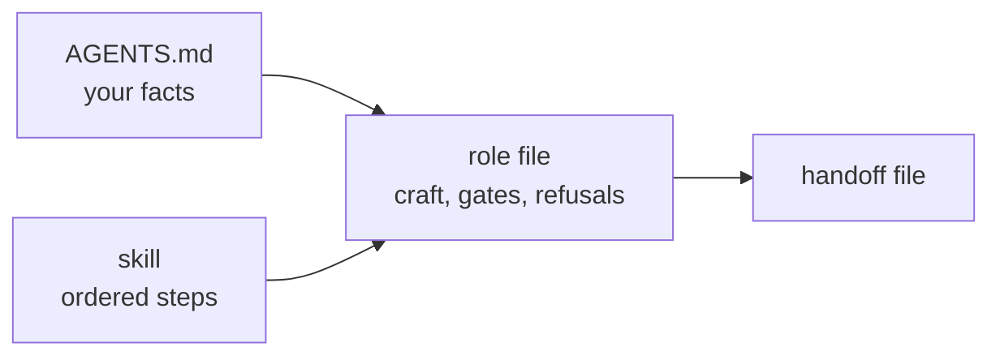

# Roles

Eight roles, each in its own context, each with a scope narrow enough that its output can be
checked. A role file states five things — `Scope`, `Inputs`, `Rules`, `Gates`, `Output` — and
the structural gate enforces that shape.

| Role | Owns | Never |
| --- | --- | --- |
| **architect** | requirements, the plan, repo split, pinned contracts | writes no product code |
| **backend-dev** | server-side repos and their unit tests | never *runs* a test |
| **frontend-dev** | the client apps the profile assigns it, and their unit tests | never runs a test |
| **reviewer** | plan review, internal review, PR review | never runs anything, never edits code |
| **tester** | the local unit-test run, narrowed to the change, in parallel lanes | writes nothing |
| **qa** | the local stack, integration verification, proofs | never edits product code |
| **releaser** | commits, push, PR, proofs, tracker writes | never greens a check by weakening it |
| **commenter** | every outward-facing sentence, in the workspace's voice | never invents a fact |

[The full role files :material-arrow-right:](https://github.com/vsdudakov/troika/blob/main/ROLES.md){ .md-button }

## The refusals are the design

Most of what makes the pipeline work is what a role will *not* do.

**Dev roles write tests but never run them.** A role that can run its own tests will iterate
until they pass, and a test that was shaped by that loop tests the implementation rather than
the requirement. Writing blind and handing the run to the tester keeps the test honest — and
the dev role must record the *collected* count, which the reviewer checks against the tests
actually written.

**The reviewer never runs anything.** A reviewer with a shell starts debugging, and a
debugging reviewer stops reviewing. It reads the diff and the required context, and it cites
`file:line`.

**QA never edits product code.** A QA pass that can patch the thing it is verifying is not a
verification. When QA finds a defect it routes it back to the owning dev role with a proof.

**Only the releaser commits.** One role produces history, so a mid-flow commit cannot smuggle
past review.

## One repo, one lane

Ownership splits **paths, not branches**. Two roles working in one repo share a worktree and a
branch, and they take turns in dependency order — never a branch per role. The lane claim
file makes "one role writes a worktree at a time" enforceable rather than aspirational.

## Where a role's behaviour comes from

The role file carries craft that is true in any organisation. Everything specific to you —
commands, layering rules, test conventions, tracker writes — is read from the profile by
anchor at run time. That is why a role file never names a repo, and why
[`check.py`](../testing.md) fails one that does.
