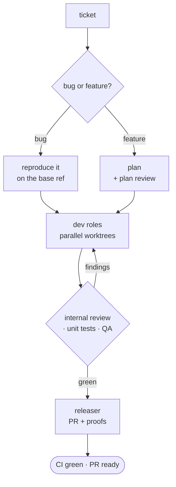

# Troika


*Nikolai Sverchkov (1817–1898), A Troika Ride Through The Snow. Public domain, via
[Wikimedia Commons](https://commons.wikimedia.org/wiki/File:Nikolai_Sverchkov_-_A_Troika_Ride_Through_The_Snow.jpg).*

**Troika turns a tracker ticket into a reviewed, QA-verified pull request.** An AI
coding-agent pipeline for full-stack developers — plan, implement, review, test, verify,
ship — with a gate at every step. Install it as a plugin for
[Claude Code](https://claude.com/claude-code),
[Codex](https://developers.openai.com/codex/cli/) or [Cursor](https://cursor.com), or run it
from plain markdown in any agent.

[](https://github.com/vsdudakov/troika/actions/workflows/check.yml)
[](https://github.com/vsdudakov/troika/blob/main/LICENSE.md)

Troika is an **agentic development pipeline**: eight specialised roles — architect,
backend and frontend developers, reviewer, tester, QA, releaser, commenter — that take a
ticket from your tracker and hand back a pull request with proofs attached. It automates the
whole loop a full-stack developer runs by hand: requirements and planning, parallel
implementation in git worktrees, **automated code review**, unit tests, **QA verification on
your real local stack**, the release PR, and the CI and review-bot watch after it. Release
cuts, **release notes** and demo builds are in the box too.

It is not a framework and not a runtime: it is **plain markdown** — roles, procedures and
templates — that any coding agent loads by path, wired into slash commands for the three
hosts that ship a plugin system.

```
/tr:dev SCRUM-123
```

Behind that one command: the ticket is classified first — a **bug is reproduced on the base
checkout** before anyone fixes it, a **feature is planned** and a different model family
reviews the plan and loops it back. Then dev roles implement in parallel worktrees, the
reviewer runs nine checks on the diff, the tester runs only the tests the change developed,
QA verifies on your real local stack with before/after proofs, and the releaser opens the PR
and watches CI.

One optional gate waits for a person — the reporter reads what will be built, or what was
reproduced, before any code is written. `/tr:dev SCRUM-123` runs the whole pipeline unattended;
`/tr:dev SCRUM-123 --ask` puts that gate in.

[Install Troika :material-arrow-right:](getting-started/installation.md){ .md-button .md-button--primary }
[Set up a workspace :material-arrow-right:](getting-started/workspace.md){ .md-button }

## Why Troika

- :vertical_traffic_light: **Gates, not vibes.** Every step is a gate. A plan is not approved
  until a reviewer on a different model family approves it; a diff is not pushed until
  [nine checks](guides/review.md) pass; a PR is not done until CI is green and the review
  bots are quiet.
- :robot: **Attended or unattended, on purpose.** Exactly one gate waits for a person, so
  a plain run is unattended end to end, `--ask` adds the one human gate — and stop conditions
  and the never-automatic list in your profile hold either way. [The pipeline :material-arrow-right:](concepts/pipeline.md#running-it-without-a-human)
- :busts_in_silhouette: **Eight roles, eight contexts.** Each has its own scope, model,
  effort and hard refusals. Dev roles write tests but never run them; the reviewer never runs
  anything. [Roles :material-arrow-right:](concepts/roles.md)
- :electric_plug: **One tree, three hosts.** The same skills are `/tr:*` commands in
  Claude Code and Cursor, and model-invoked skills in Codex — or no plugin at all, just files
  read by path. [Running without a plugin :material-arrow-right:](guides/no-plugin.md)
- :office: **Organisation-neutral by construction.** Nothing in the repository names a repo,
  command, branch, tracker, URL or person. Those live in your `.troika/PROFILE.md` and are
  linked **by anchor**. [Writing the profile :material-arrow-right:](guides/profile.md)
- :file_folder: **Per-workspace paths.** `.troika/settings.json` says where plans, worktrees and
  memory live — one file per folder-of-repos, so a single installed plugin serves every
  client and org you work in. [Paths :material-arrow-right:](concepts/paths.md)
- :test_tube: **It is tested on itself.** A structural gate checks every link, anchor and
  file shape; a behavioural gate plants seventeen known defects and asserts the role that
  claims to catch each one does. [Testing :material-arrow-right:](testing.md)

## How a ticket moves



Every loop has a cap, and every arrow back is a role handing a file to another role — never a
shared context. [The pipeline :material-arrow-right:](concepts/pipeline.md)

## What it is not

Troika does not run your agent, host a model, or wrap an API. There is no daemon, no
scheduler and no lock-in: the executable surface is two Python scripts on the standard
library, and everything else is markdown you can fork, trim, or run by hand.

It also makes no claim to work well on a codebase whose profile is not written. A vague
A vague profile produces vague gates — the roles are only as sharp as the facts you give them.

## Licence

[MIT](https://github.com/vsdudakov/troika/blob/main/LICENSE.md) © Troika contributors.
If it saves your team time, consider
[sponsoring on GitHub](https://github.com/sponsors/vsdudakov). :heart:
