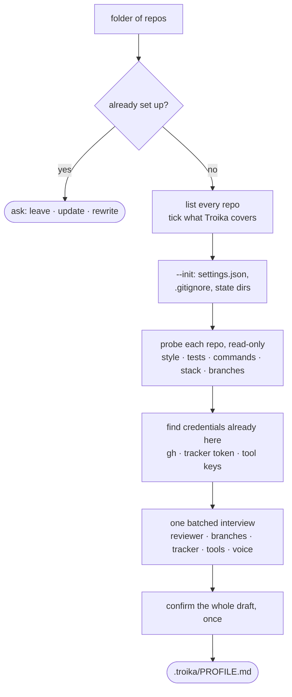
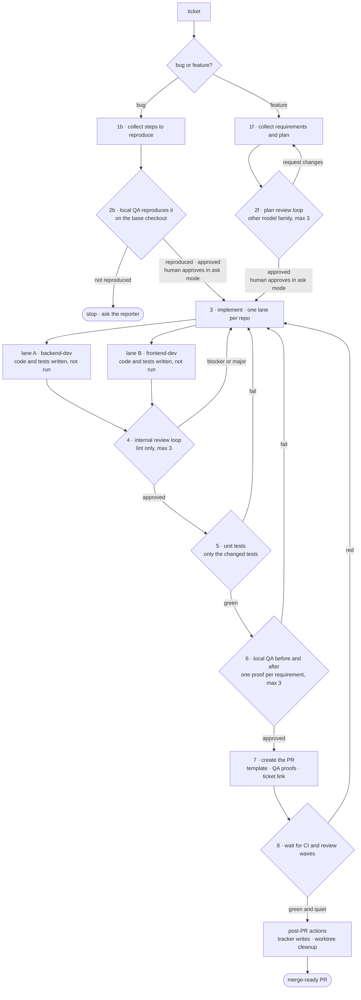
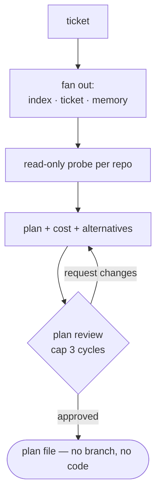
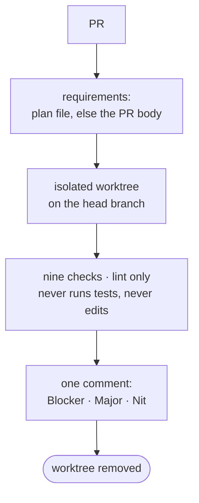
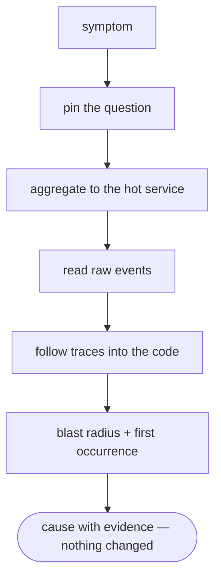
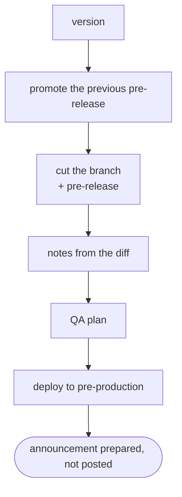
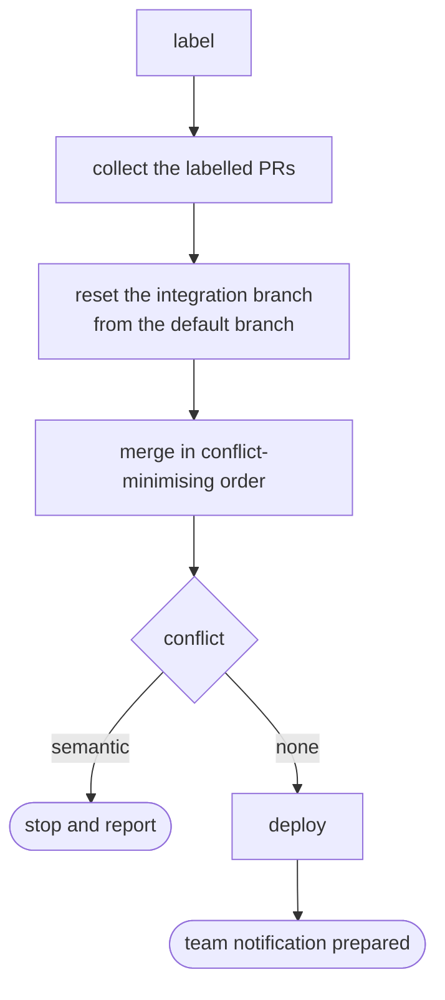

# Commands

Nine commands, one per procedure you **start** a session with. In Claude Code and Cursor they
appear as `/tr:<name>`; in Codex the same procedures are model-invoked skills with no `/`
prefix.

Every command does the same three things before it starts: resolves the workspace (creating the
state directories), reads the procedure, and reads `$TROIKA_PROFILE`.

`/tr:setup` is the exception, and the one to run first: it is what *creates* the workspace
the others resolve, so it cannot open by resolving one. Every other command exits immediately
until it has been run once.

## The commands

| Command | Procedure | Argument | What it does |
| --- | --- | --- | --- |
| `/tr:setup` | `workspace-setup` | `[PATH]` | creates `.troika/` and writes the profile — reads your repos first, asks only what they cannot answer |
| `/tr:dev` | `develop-flow` | `<TICKET>` | the whole pipeline, ticket to merge-ready PR — bugs reproduce first, features plan first; unattended unless you pass `--ask` |
| `/tr:spike` | `spike` | `<TICKET>` | investigates the ticket and produces a reviewed plan — and stops there, nothing is built |
| `/tr:review` | `pr-review` | `<PR>` | reviews an open PR in an isolated worktree and posts one comment |
| `/tr:fix` | `fix-pr` | `<PR>` | fixes an open PR — what you describe, or its unresolved review comments |
| `/tr:qa` | `qa-verify` | `<PR>` | verifies a PR on the local stack and captures a proof per requirement |
| `/tr:triage` | `incident-triage` | `<ISSUE>` | investigates a production symptom read-only, lands on a cause with evidence |
| `/tr:release` | `release-cut` | `<VERSION>` | cuts a periodic release end to end |
| `/tr:demo` | `demo-prep` | `[LABEL]` | builds the demo integration branch, deploys, prepares the notification |

## Who runs which

The split a team ends up with, in the order a week happens:

| Who | When | What they type |
| --- | --- | --- |
| developer | a ticket is assigned | `/tr:dev SCRUM-123` — or `/tr:spike SCRUM-123` first, when it needs sizing or a design call |
| developer | their PR is open and reviewed | `/tr:fix <PR URL>` for every unresolved comment, or `/tr:fix <PR URL> stream the export instead of buffering it` for a change you name |
| developer | reviewing a teammate's PR | `/tr:review <PR URL>`, and `/tr:qa <PR URL>` when it needs proving on a running stack |
| anyone | a production symptom or a pasted stack trace | `/tr:triage <stack trace>` |
| release manager | demo day | `/tr:demo release/X.Y.Z` |
| release manager | the release cadence says cut | `/tr:release release/X.Y.Z` |
| the ticket's reporter | asked once at 2r, before any code — only on a `--ask` run | answers **go ahead**, **change this** (with what), or **not this at all** |

**Flag.** `/tr:dev` takes one: `--ask`, after the ticket — `/tr:dev SCRUM-123 --ask` — which
stops at the reporter-review gate and waits for their answer. Without it the run is unattended
end to end. There is no flag for the other direction, because a plain run already is it.
Unattended never silences a stop condition and never overrides what the profile marks
never-automatic.

`/tr:fix` always pushes to the PR's own branch — no command here opens a second PR for work
that already has one. `/tr:demo` and `/tr:release` stop at a drafted announcement and wait for
a human to send it. Every one of them needs `/tr:setup` to have been run once.

## The flow of each command

<a id="setup"></a>
### `/tr:setup` — create the workspace



<a id="dev"></a>
### `/tr:dev` — ticket to merge-ready PR

Steps 0 – 2r decide what gets built; from step 3 the two paths are one flow:

- **bug** — steps to reproduce → **local QA reproduces it on the base ref** → *(reporter review, under `--ask`)* → fix → internal review loop → unit tests → local QA before/after → PR with proofs → CI + post-PR actions
- **feature** — requirements → plan → **plan review loop** → *(reporter review, under `--ask`)* → implement → internal review loop → unit tests → local QA before/after → PR with proofs → CI + post-PR actions

The reporter review is the only step that waits for a person, and a plain run does not run it —
`--ask` is what puts the gate in. Your profile's `#autonomy` anchor says who that reporter is
and how they are reached ([Running it without a human](../concepts/pipeline.md#running-it-without-a-human)).



`2r` is the only step that waits for a person: a plain run passes straight through it, and
`--ask` is what makes it stop for the reporter's answer ([Running it without a human](../concepts/pipeline.md#running-it-without-a-human)).

<a id="spike"></a>
### `/tr:spike` — plan it, build nothing



<a id="fix"></a>
### `/tr:fix` — fix an open PR in place


<a id="review"></a>
### `/tr:review` — read-only PR review



<a id="qa"></a>
### `/tr:qa` — verify on the real local stack


<a id="triage"></a>
### `/tr:triage` — production symptom to cause



<a id="release"></a>
### `/tr:release` — cut a periodic release



<a id="demo"></a>
### `/tr:demo` — build the demo branch



## Arguments

The hint is one upper-case word naming what the first step resolves; the forms it accepts
(a number, a link, a ticket key, a pasted stack trace) are the procedure's business, not the
menu's. `<>` is required, `[]` optional.

## Procedures without a command

The steps `/tr:dev` runs for you are procedures too, but they are not in the `/` menu:

| Procedure | Runs | Leaves behind |
| --- | --- | --- |
| `plan-review` | reviewer | `…-plan-review-<n>.md` |
| `implement-change` | a dev role | a worktree and `…-<role>.md` |
| `internal-review` | reviewer | `…-review-<n>.md` |
| `run-unit-tests` | tester | `…-tests-<n>.md` and lane logs |
| `release-pr` | releaser | commit, PR, ticket update |
| `release-notes` | releaser | a release's notes from the diff |
| `ticket-intake` | architect · commenter | a well-shaped ticket, created or reshaped |

Most are read as `SKILL.md` by the role running them, so a `/` entry would only offer an
entry point that is wrong to start on its own — `internal-review` with no branch to review,
or `release-pr` with nothing reviewed to ship. All three hosts still discover every one of
them as a skill, so you can ask for one by name ("run internal-review on this branch", "run
ticket-intake for the Q3 export work") and the model pulls it in. The `/` menu is the short
list of ways to *start*, not the list of what Troika can do.

`/tr:fix` is the other half of `/tr:review`: the reviewer posts findings and stops,
and `fix-pr` picks an open PR up from there. With no description it works through the
unresolved review comments, fixing or rejecting each one with a reason; with a description it
does exactly that instead, and still reports the comments it left alone. Either way the work
goes through the owning dev roles, gets re-reviewed and re-tested, and is pushed to the same
branch — it never opens a second PR.

`qa-verify` is the one procedure with both roles: the flow runs it at step 6 against the
lanes it just built, and `/tr:qa` runs it against a PR that already exists — checking
the head branch out into its own worktree first, and saying in the report where it had to
take the requirements from when there is no plan file to read.

## Not procedures at all

References (`worktree`, `scratchpad`, `memory`, `cross-repo`, `tracker`) and templates
(`plan-template`, `pr-template`) are skills without commands for a different reason — they
are read *by* a procedure or filled by one, never run.

## Regenerating them

Commands are generated from `COMMANDS` in `plugin/generate.py` — the alias and the argument
hint — plus the procedure's own frontmatter for the description:

```bash
python3 plugin/generate.py
python3 tests/check.py     # fails on a stale, missing or orphaned command
```

Edit the procedure, or the map, never the command file. Adding a procedure to `COMMANDS`
gives it a `/` entry; removing it there leaves the skill in place and takes only the menu
entry away.
